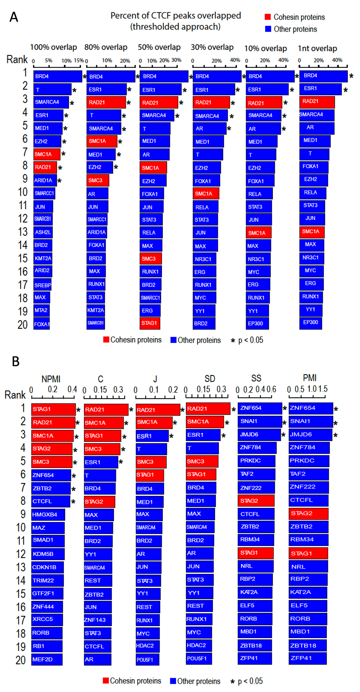

Compare different metrics
--------------------------

The table below gives the lower and upper bounds of the 6 metrics and their major drawbacks if any.

.. list-table::
   :widths: 5,20,20,35
   :header-rows: 1

   * - *Metric*
     - *Lower bound*
     - *Upper bound*
     - *Comments*
   * - C(A,B)
     - 0 (no overlap)
     - 1 (A = B)
     -   
   * - J(A,B)
     - 0 (no overlap)
     - 1 (A = B)
     - Bias towards the **larger** interval
   * - SD(A,B)
     - 0 (no overlap)
     - 1 (A = B)
     - Bias towards the **larger** interval
   * - SS(A,B)
     - 0 (no overlap)
     - 1 (A = B, A ∈ B, or B ∈ A)
     - Bias towards the **smaller** interval
   * - PMI
     - -inf (no overlap)
     - min(-log(p(A)), -log(p(B)))
     - No fixed bound
   * - NPMI
     - -1 (no overlap)
     - 1 (A = B)
     -   
     
.. list-table:: **C(A,B)** vs **J(A,B)** vs **SD(A,B)** vs **SS(A,B)**
   :widths: 15,15,15,15,15,15,15,15,20
   :header-rows: 1

   * - *SROG*
     - \|A\|
     - \|B\|
     - \|A ∩ B\|
     - \|A ∪ B\|
     - *C*
     - *J*
     - *SD*
     - *SS*
   * - A equals B
     - 1000
     - 1000
     - 1000
     - 1000
     - 1
     - 1
     - 1
     - 1
   * - A disjoint B 
     - 1000
     - 1000
     - 0
     - 2000
     - 0
     - 0
     - 0
     - 0
   * - A overlaps B 
     - 100
     - 1000
     - 50
     - 1050
     - 0.158
     - 0.0476
     - 0.0909
     - 0.5
   * - A within B 
     - 100
     - 1000
     - 100
     - 1000
     - 0.316
     - 0.1
     - 0.182
     - 1

CTCF: Demonstration
-------------------

70-95% of `CTCF <https://en.wikipedia.org/wiki/CTCF>`_ binding sites are also bound by `cohesin <https://en.wikipedia.org/wiki/Cohesin>`_ complex (including SMC1, SMC3, RAD21/SCC1, STAG1/SA1, STAG2/SA2) to establish chromatin loops and regulate gene expression [#f1]_ [#f2]_. 

We used CTCF-cohesin as a positive control to evaluate the performance of the conventional threshold-and-count approach as well as six other collocation measurements (including C, J, SD, SS, PMI and NPMI).  We first calculated the scores of these metrics between all the binding sites (defined as cistrome) of `CTCF <https://en.wikipedia.org/wiki/CTCF>`_ with those cistromes of ~1200 TFs curated in the `ReMap <https://remap2022.univ-amu.fr/>`_ database. Then, we compared the performances of these measurements to rank these 1200 TFs, assuming that **a better approach would be able to rank CTCF’s cofactors (cohensin proteins) higher in the list**. 

**(A)** Collocation between CTCF binding sites and the binding sites of 1200 TFs were evaluated uing the conventional approach. With conventional approach, one first need to set an arbitrary cutoff to call if two genomic intervals are overlapped. And then calculate what percent of CTCF peaks that are overlapped with each TF. Six different thresholds were applied. Only the top 20 TFs were displayed. **(B)** Collocation between CTCF binding sites and the binding sites of 1200 TFs were evaluated uing six collocation metrics (including C, J, SD, SS, PMI and NPMI). 

.. [#f1] Pugacheva EM, Kubo N, Loukinov D, et al. CTCF mediates chromatin looping via N-terminal domain-dependent cohesin retention. Proc Natl Acad Sci U S A. 2020;117(4):2020-2031. doi:10.1073/pnas.1911708117
.. [#f2] Xiao T, Li X, Felsenfeld G. The Myc-associated zinc finger protein (MAZ) works together with CTCF to control cohesin positioning and genome organization. Proc Natl Acad Sci U S A. 2021;118(7):e2023127118. doi:10.1073/pnas.2023127118