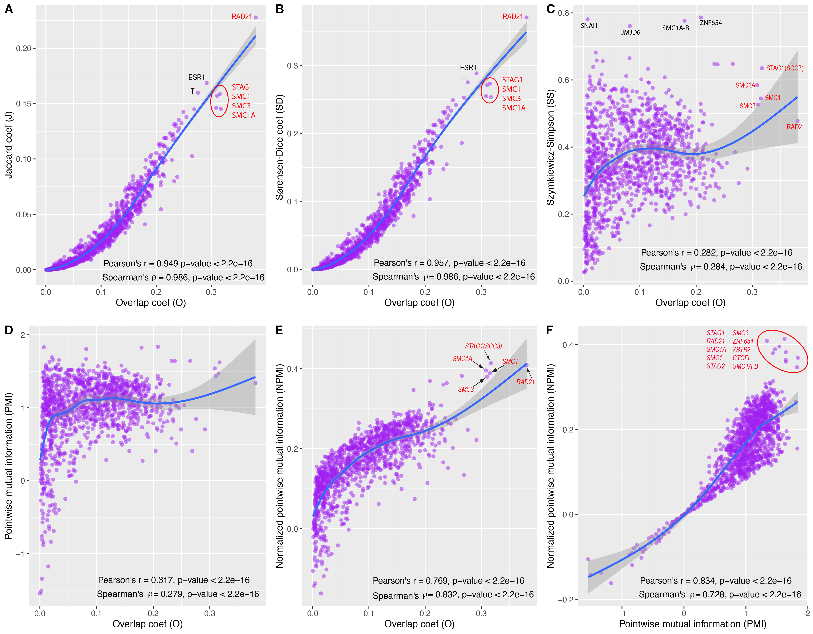

Compare different metrics
--------------------------

The table below gives the lower and upper bounds of the 6 metrics and their major drawbacks if any.

.. list-table::
   :widths: 5,20,20,35
   :header-rows: 1

   * - *Metric*
     - *Lower bound*
     - *Upper bound*
     - *Comments*
   * - O(A,B)
     - 0 (no overlap)
     - 1 (A = B)
     -   
   * - J(A,B)
     - 0 (no overlap)
     - 1 (A = B)
     - Bias towards the **larger** interval
   * - SD(A,B)
     - 0 (no overlap)
     - 1 (A = B)
     - Bias towards the **larger** interval
   * - SS(A,B)
     - 0 (no overlap)
     - 1 (A = B, A ∈ B, or B ∈ A)
     - Bias towards the **smaller** interval
   * - PMI
     - -inf (no overlap)
     - min(-log(p(A)), -log(p(B)))
     - No fixed bound
   * - NPMI
     - -1 (no overlap)
     - 1 (A = B)
     -   
     
.. list-table:: **O(A,B)** vs **J(A,B)** vs **SD(A,B)** vs **SS(A,B)**
   :widths: 15,15,15,15,15,15,15,15,20
   :header-rows: 1

   * - *SROG*
     - \|A\|
     - \|B\|
     - \|A ∩ B\|
     - \|A ∪ B\|
     - *O*
     - *J*
     - *SD*
     - *SS*
   * - A equals B
     - 1000
     - 1000
     - 1000
     - 1000
     - 1
     - 1
     - 1
     - 1
   * - A disjoint B 
     - 1000
     - 1000
     - 0
     - 2000
     - 0
     - 0
     - 0
     - 0
   * - A overlaps B 
     - 100
     - 1000
     - 50
     - 1050
     - 0.158
     - 0.0476
     - 0.0909
     - 0.5
   * - A within B 
     - 100
     - 1000
     - 100
     - 1000
     - 0.316
     - 0.1
     - 0.182
     - 1

CTCF: Demonstration
-------------------

70-95% of `CTCF <https://en.wikipedia.org/wiki/CTCF>`_ binding sites are also bound by `cohesin <https://en.wikipedia.org/wiki/Cohesin>`_ complex (including SMC1, SMC3, RAD21/SCC1, STAG1/SA1, STAG2/SA2) to establish chromatin loops and regulate gene expression [#f1]_ [#f2]_. 

We evaluated the overlaps between `CTCF <https://en.wikipedia.org/wiki/CTCF>`_ binding sites and the binding sites of 1200 other transcription factors, to see if cohesin proteins were 
ranked on the top of the list. 

Based on the ranks of cohesin complex proteins, `Overlap coefficient (O) <https://cobind.readthedocs.io/en/latest/usage/overlap.html>`_ and `NPMI <https://cobind.readthedocs.io/en/latest/usage/NPMI.html>`_ are the best two metrics 
to quantify overlapping. 

CTCF: Compare NPMI to "percent of overlap"
------------------------------------------

"Percent of overlap" is a tradional and widely used approach to quantify the overlap between two sets (A and B) of genomic intervals. First, one need to set an arbitrary cutoff to call if two genomic intervals are overlapped. Then, calculate what percent of genomic intervals from set A are overlapped with set B. Obviously, the "percent of genomic intervals overlapped" is conditioned on the cutoff. 

In the Figure below, we compared NPMI (panel A) to three different cutoffs (panels B to D). Only the top 100 TFs were displayed, and the members of the cohesin complex were marked by red bar.

.. image:: _static/rank_comparison.png
  :width: 950
  :alt: Alternative text

.. [#f1] Pugacheva EM, Kubo N, Loukinov D, et al. CTCF mediates chromatin looping via N-terminal domain-dependent cohesin retention. Proc Natl Acad Sci U S A. 2020;117(4):2020-2031. doi:10.1073/pnas.1911708117
.. [#f2] Xiao T, Li X, Felsenfeld G. The Myc-associated zinc finger protein (MAZ) works together with CTCF to control cohesin positioning and genome organization. Proc Natl Acad Sci U S A. 2021;118(7):e2023127118. doi:10.1073/pnas.2023127118