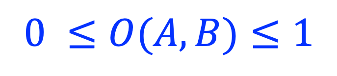
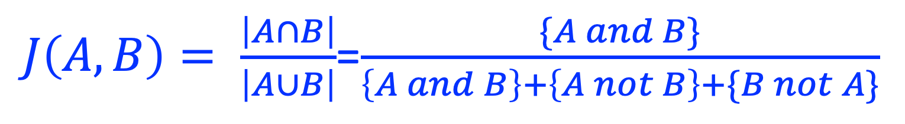
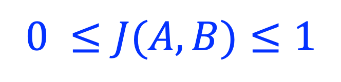
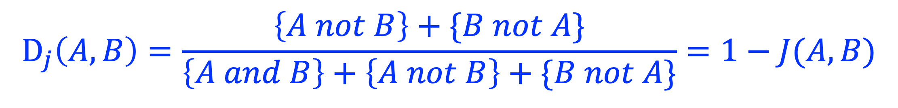
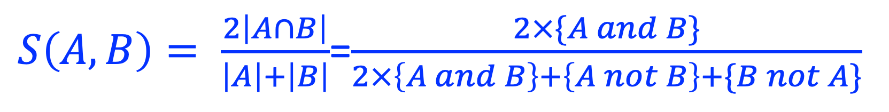
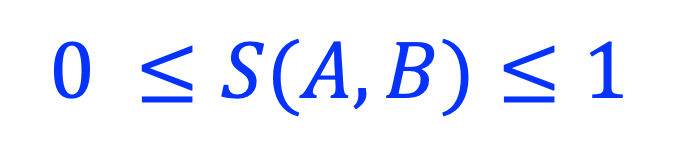

Definitions
============

Spacial Relations of Genomic regions (SROG)
-------------------------------------------

The spacial relations between two genomic regions (A and B) are defined as: 

.. image:: _static/srog.png
  :width: 700
  :alt: Alternative text

Overlap coefficient
-------------------
Peak set A contains *m* bases, and peak set B contains *n* bases. A and B overlap *k* bases. 
The overlap coefficient (**O**) between A and B is calculated as:

.. image:: _static/ov_coef_1.png
  :width: 150
  :alt: Alternative text

The overlap coefficient (*O*) is a value between [0, 1] with 0 indicating 'no overlap', and 1 indicating '100% overlap' (i.e., A and B are identical).

The geometrical interpretation of o^2 is illustrated as below:

.. image:: _static/ov_coef_2.png
  :width: 600
  :alt: Alternative text

- **overall overlap coefficient**: The overlap coefficient between two **sets** of genomic regions. 
- **peakwise overlap coefficient**: The overlap coefficient between two genomic regions (A protein-bound genomic region is called "peak" in `ChIP-seq <https://en.wikipedia.org/wiki/ChIP_sequencing>`_ experiment). 

Jaccard coefficient
-------------------
The `Jaccard similarity coefficient <https://en.wikipedia.org/wiki/Jaccard_index>`_, also known as the Jaccard index. It is the ratio between **intersection** and **union**.

In the figure below, for simplicity, both A and B contain only one genomic region.

.. image:: _static/pmi_background.png
  :width: 600
  :alt: Alternative text

The Jaccard distance Dj is calculated as:

We can calculate Jaccard coefficient between two BED files (i.e., *overall coefficient*) or between two genomic regions (i.e., *peakwise coefficient*).

- **overall Jaccard coefficient**: The Jaccard coefficient between two **sets** of genomic regions. 
- **peakwise Jaccard coefficient**: The Jaccard coefficient between two genomic regions (A protein-bound genomic region is called "peak" in `ChIP-seq <https://en.wikipedia.org/wiki/ChIP_sequencing>`_ experiment).

Sørensen–Dice (SD) coefficient
------------------------------
`Sørensen–Dice coefficient <https://en.wikipedia.org/wiki/S%C3%B8rensen%E2%80%93Dice_coefficient>`_,  also called *Sørensen–Dice index*, *Sørensen index* or *Dice's coefficient*.

Jaccard coefficient (J) can be converted into Sørensen–Dice coefficient (S) and vice versa:

*J = S/(2-S)* and *S = 2J/(1+J)*

Jaccard/SD coefficient vs Overlap coefficient
----------------------------------------------

Same as the overlap coefficient (**O**), Jaccard coefficient (**J**) and SD coefficient (**S**) are also within [0, 1] with 0 indicating 'no overlap', and 1 indicating '100% overlap'. However, When the sizes of two genomic regions are significantly different, the **O** gives more weight to the smaller genomic region, while the **J** and **S** give more weight to the larger genomic region.

.. list-table:: **Jaccard/SD coefficient** (*J*) vs **overlap coefficient** (*O*)
   :widths: 20,20,20,20,20,20,20
   :header-rows: 1

   * - Interval_A (size)
     - Interval_B (size)
     - Overlap (size)
     - Union (size)
     - *O*
     - *J*
     - *S*
   * - 1000
     - 1000
     - 1000
     - 1000
     - 1
     - 1
     - 1
   * - 1000
     - 1000
     - 0
     - 2000
     - 0
     - 0
     - 0
   * - 100
     - 1000
     - 50
     - 1050
     - 0.158
     - 0.0476
     - 0.0909
   * - 100
     - 1000
     - 100
     - 1000
     - 0.316
     - 0.1
     - 0.182

Pointwise mutual information
----------------------------
`Pointwise mutual information (PMI) <https://en.wikipedia.org/wiki/Pointwise_mutual_information>`_ is one of the standard association measures in collocation analysis. 
It measures how much the observed overlaps differ from what we would expect them to be. Assume A and B represent two sets of genomic regions bound by `transcription factor <https://en.wikipedia.org/wiki/Transcription_factor>`_ A and B; respectively, PMI measures if A and B bind together or separately.

PMI is calculated as:

.. image:: _static/pmi.png
  :width: 300
  :alt: Alternative text

where, *p(A) = A/g*, *p(B) = B/g*, *p(A and B) = {A and B}/g* as shown in Fig. 3.

- **PMI = 0** indicates that A and B are independent.
- **PMI > 0** indicates that the overlapping between A and B is in a frequency *higher* than what we would expect if A and B are independent (i.e, A and B tend to bind together). 
- **PMI < 0** indicates that the overlapping between A and B is in frequency *lower* than what we would expect if A and B are independent. (i.e., A and B tend to bind separately). 

Note, PMI has no boundaries:

.. image:: _static/pmi_bound.png
  :width: 500
  :alt: Alternative text

Normalized pointwise mutual information
---------------------------------------
Normalized pointwise mutual information (NPMI) is calculated as:

.. image:: _static/npmi.png
  :width: 650
  :alt: Alternative text

Note, after normalization, NPMI is confined to [-1, 1]:

.. image:: _static/npmi_bound.png
  :width: 250
  :alt: Alternative text

