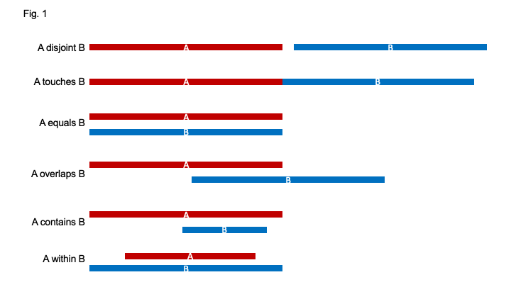
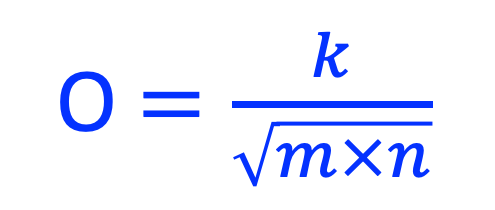
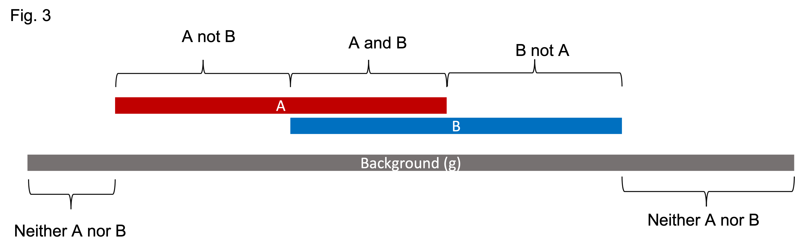
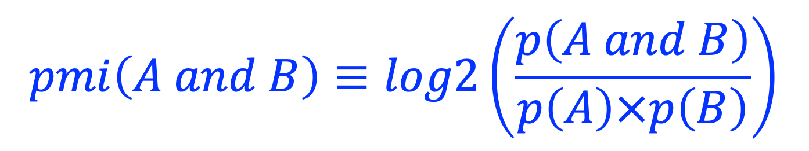
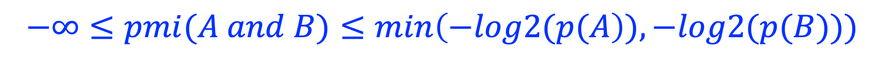
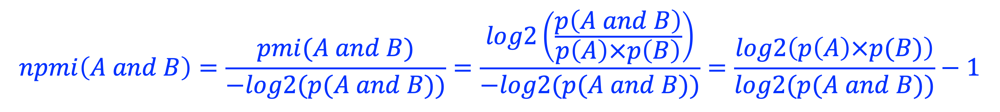

Definitions
============

Spacial Relations of Genomic regions (SROG)
-------------------------------------------

The spacial realtions between two genomic regions (A and B) is defined as below: 

Overlap coefficient
-------------------
Peak set A contains *m* bases, and peak set B contains *n* bases. A and B overlap *k* bases. 
The overlap coefficient (*o*) between A and B is calculated as:

The overlap coefficient (*o*) is a value between [0, 1] with 0 (when k = 0) indicating 'no overlap', and 1 (when k = m = n) indicating '100% overlap' (i.e., **equal** as shown in the above SROG chart).

The geometrical interpretation of o^2 is illustrated as below:

.. image:: _static/ov_coef_2.png
  :width: 600
  :alt: Alternative text

- **overall overlap coefficient**: The overlap coefficient between two **sets** of genomic regions. 
- **peakwise overlap coefficient**: The overlap coefficient between two genomic regions (A protein-bound genomic region is called "peak" in `ChIP-seq <https://en.wikipedia.org/wiki/ChIP_sequencing>`_ experiment). 

Pointwise mutual information
----------------------------  

`Pointwise mutual information (PMI) <https://en.wikipedia.org/wiki/Pointwise_mutual_information>`_ is one of the standard association measures in collocation analysis. 
It measures how much the observed overlaps differ from what we would expect them to be. Assume A and B represents two sets of genomic regions bound by `transcription factor <https://en.wikipedia.org/wiki/Transcription_factor>`_ A and B, respectively, PMI measures if A and B bind together or separately.

In the figure below, for simplicity, both A and B contain only one genomic region.

PMI is calculated as:

where, *p(A) = A/g*, *p(B) = B/g*, *p(A and B) = {A and B}/g*. 

- **PMI = 0** indicates A and B are independent.
- **PMI > 0** indicates the overlapping between A and B is in a frequency *highe* than what we would expect if A and B are independent (i.e, A and B tend to bind together). 
- **PMI < 0** indicates the overlapping between A and B is in frequency *lower* than what we would expect if A and B are independent. (i.e, A and B tend to bind separately). 

Note, PMI has no boundaries:

Normalized pointwise mutual information
---------------------------------------
Normalized pointwise mutual information (NPMI) is calculted as:

Note, after normalization, NPMI is confined to [-1, 1]:

.. image:: _static/npmi_bound.png
  :width: 200
  :alt: Alternative text

