Definitions
============

Symbols definitions
-------------------

We have two sets of genomic intervals **A** and **B**. The genomic background is **G** (e.g., all the cis-regulatory elements in the genome).
In Figure 1 below, for simplicity, both A and B contain only 1 genomic region.  

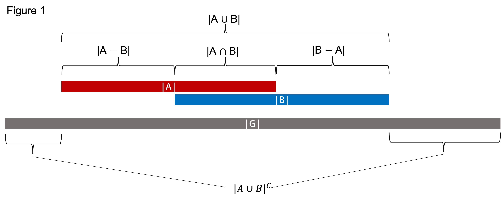

Symbols are defined as:

\|A\|
  All the **non-redundant** bases covered by genomic interval A. For example, if A contains two genomic intervals: "chr1 0 10", "chr1 5 15", then \|A\| = 15. 
\|B\|
  All the **non-redundant** bases covered by genomic interval B.
\|G\|
  The genomic background (user defined). Depending on the context, this can be *all the cis-regulatory elements*, *all the promoters*, *all the TF binding sites* in the genome.
\|A ∪ B\|
  Union (A or B). In A or B (or both).
\|A ∩ B\|
  Intersection (A and B). In both A and B.
\|A − B\|
  Difference (A not B). in A but not in B.
\|B − A\|
  Difference (B not A). in B but not in A.
\|A ∪ B\|^𝐶
  Complement of \|A ∪ B\| (Neither A nor B).

Spacial Relations of Genomic regions (SROG)
-------------------------------------------

There are six different spacial relations between two genomic regions (A and B): 

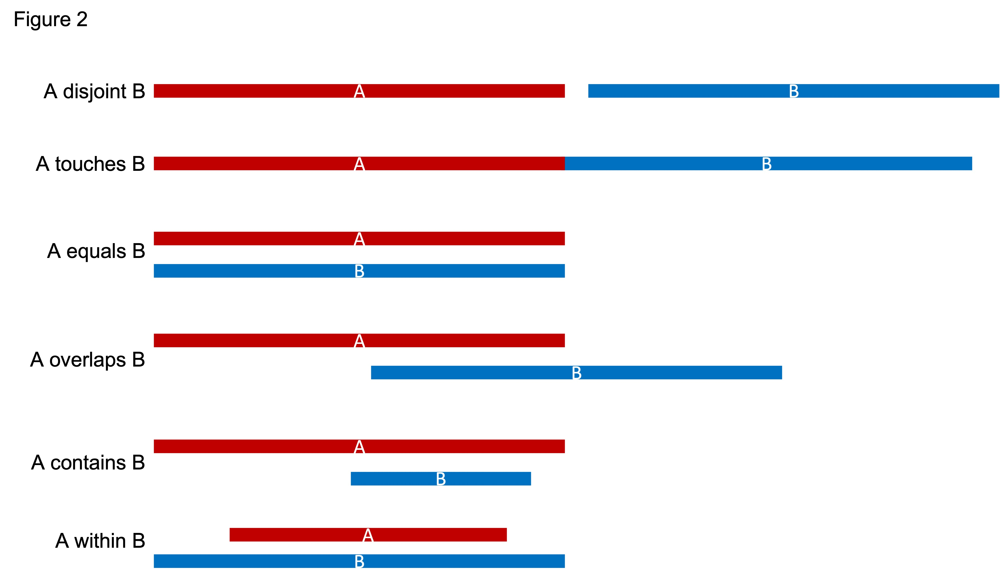

Overlap coefficient (O)
-----------------------
The overlap coefficient between A and B is calculated as the ratio between *intersection of A and B* and the *geometric mean of A and B*.

 - O(A,B) is a value between [0, 1] with 0 indicating 'no overlap', and 1 indicating '100% overlap' (i.e., A and B are identical). 
 - O(A, B) is defined as 0 when \|A\| = 0 or \|B\| = 0, or  \|A\| = \|B\| = 0.

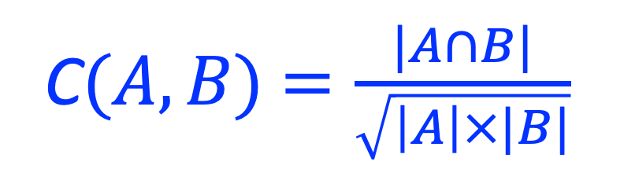

.. image:: _static/ov_coef_3.jpeg
  :width: 200
  :alt: Alternative text

The geometrical interpretation of O^2 is illustrated as below:

.. image:: _static/ov_coef_2.jpg
  :width: 600
  :alt: Alternative text

Overall overlap coefficient
  The overlap coefficient between two **sets** of genomic regions. For example, you can use the *overall overlap coefficient* to measure the cobindability of two transcription factors. 

peakwise overlap coefficient
  The overlap coefficient between two genomic regions (A protein-bound genomic region is called "peak" in `ChIP-seq <https://en.wikipedia.org/wiki/ChIP_sequencing>`_ experiment). 

Jaccard coefficient (J)
-------------------------
The `Jaccard similarity coefficient <https://en.wikipedia.org/wiki/Jaccard_index>`_, also known as the Jaccard index. It is the ratio between **intersection** and **union**.

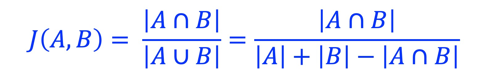

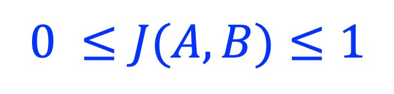

J(A, B) is defined as 0 when \|A\| = 0 or \|B\| = 0, or  \|A\| = \|B\| = 0.

The Jaccard distance *Dj* is calculated as:

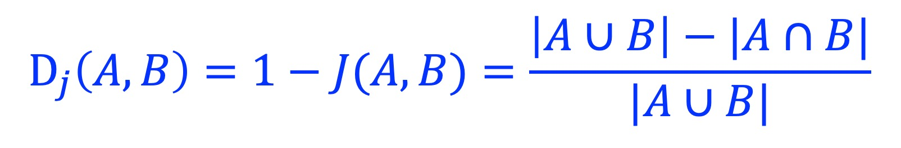

Similar to O(A,B)m, we have **overall Jaccard coefficient** and **peakwise Jaccard coefficient**.

overall Jaccard coefficient
  The Jaccard coefficient between two **sets** of genomic regions. 
peakwise Jaccard coefficient
  The Jaccard coefficient between two genomic regions (A protein-bound genomic region is called "peak" in `ChIP-seq <https://en.wikipedia.org/wiki/ChIP_sequencing>`_ experiment).

Sørensen–Dice coefficient (SD)
------------------------------
`Sørensen–Dice coefficient <https://en.wikipedia.org/wiki/S%C3%B8rensen%E2%80%93Dice_coefficient>`_,  also called *Sørensen–Dice index*, *Sørensen index* or *Dice's coefficient*.

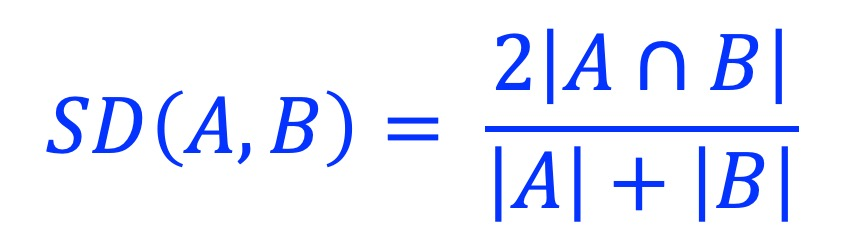

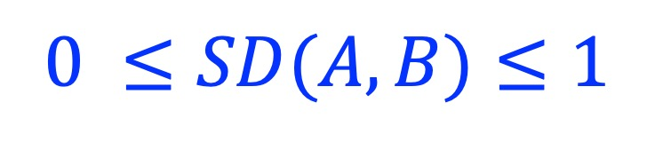

SD(A, B) is defined as 0 when \|A\| = 0 or \|B\| = 0, or  \|A\| = \|B\| = 0.

Jaccard coefficient (J) can be converted into Sørensen–Dice coefficient (SD) and vice versa:

*J = SD/(2-SD)* and *SD = 2J/(1+J)*

Szymkiewicz–Simpson coefficient (SS)
-------------------------------------
`Szymkiewicz–Simpson coefficient <https://en.wikipedia.org/wiki/Overlap_coefficient>`_ is defined as the size of the intersection divided by the smaller of the size of the two sets.

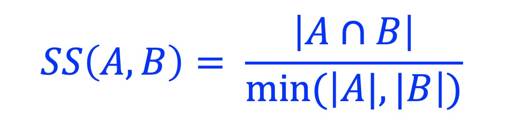

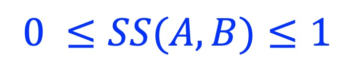

Coefficients comparison
------------------------

 - **O(A,B)**, **J(A,B)**, and **SD(A,B)** are all within [0, 1] with 0 indicating 'no overlap', and 1 indicating '100% overlap' (i.e., A equals B).
 - **SS(A,B)** is different, with 0 indicating 'no overlap', and 1 indicating "A equals B", or "A within B" or "B within A" .
 - When the sizes of two genomic regions are significantly different, the **SS(A,B)** gives more weight to the smaller genomic region, while the **J(A,B)** and **SD(A,B)** give more weight to the larger genomic region, **O(A,B)** is a compromised index between the two extremes. 

.. list-table:: **O(A,B)** vs **J(A,B)** vs **SD(A,B)** vs **SS(A,B)**
   :widths: 15,15,15,15,15,15,15,15,20
   :header-rows: 1

   * - *SROG*
     - \|A\|
     - \|B\|
     - \|A ∩ B\|
     - \|A ∪ B\|
     - *O*
     - *J*
     - *SD*
     - *SS*
   * - A equals B
     - 1000
     - 1000
     - 1000
     - 1000
     - 1
     - 1
     - 1
     - 1
   * - A disjoint B 
     - 1000
     - 1000
     - 0
     - 2000
     - 0
     - 0
     - 0
     - 0
   * - A overlaps B 
     - 100
     - 1000
     - 50
     - 1050
     - 0.158
     - 0.0476
     - 0.0909
     - 0.5
   * - A within B 
     - 100
     - 1000
     - 100
     - 1000
     - 0.316
     - 0.1
     - 0.182
     - 1

Pointwise mutual information (PMI)
----------------------------------
`Pointwise mutual information (PMI) <https://en.wikipedia.org/wiki/Pointwise_mutual_information>`_ is one of the standard association measures in collocation analysis. 
It measures how much the observed overlaps differ from what we would expect them to be. Assume A and B represent two sets of genomic regions bound by `transcription factor <https://en.wikipedia.org/wiki/Transcription_factor>`_ A and B; respectively, PMI measures if A and B bind together or separately.

PMI is calculated as:

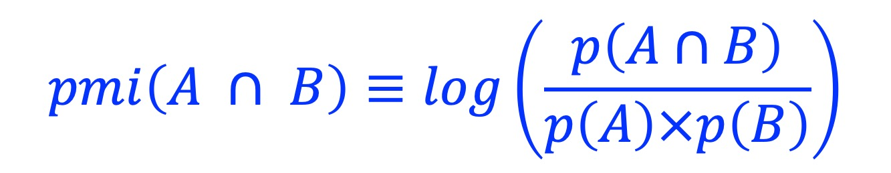

where 

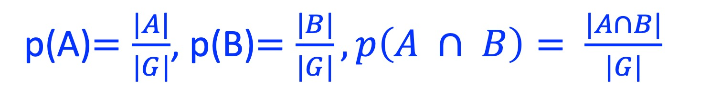

PMI = 0
  Indicates that A and B are independent.
PMI > 0
  Indicates that the overlapping between A and B is in a frequency *higher* than what we would expect if A and B are independent (i.e, A and B tend to bind together). 
PMI < 0
  Indicates that the overlapping between A and B is in frequency *lower* than what we would expect if A and B are independent. (i.e., A and B tend to bind separately). 

Note, PMI has no boundaries:

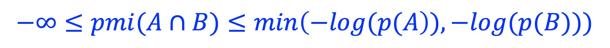

Normalized pointwise mutual information (NPMI)
----------------------------------------------
Normalized pointwise mutual information (NPMI) is calculated as:

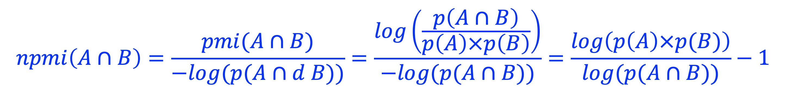

Note, after normalization, NPMI is confined to [-1, 1]:

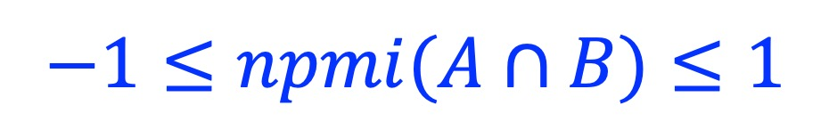

