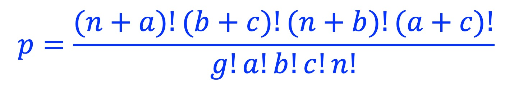
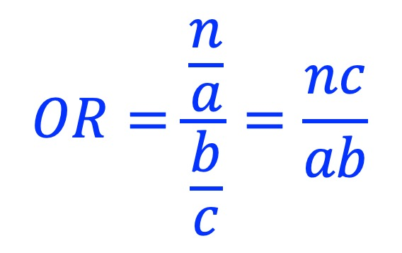

Cooccurrence
============

Description
-------------
Use `Fisher's exact test <https://en.wikipedia.org/wiki/Fisher%27s_exact_test>`_ to evaluate if two sets of genomic intervals (A and B) are significantly cooccured [#f1]_. Genomic intervals (**g**) in the background BED file will be divided into 4 groups: **a** (A specific), **b** (B specific), **c** (A and B cooccur), and **n** (neith A nor B). 

+------------+--------+------+--------------------+
|            | Not A  | A    | Total              |
+============+========+======+====================+
| **Not B**  | n      | a    | n+a                |
+------------+--------+------+--------------------+
| **B**      | b      | c    | b+c                |
+------------+--------+------+--------------------+
| **Total**  | n+b    | a+c  | g = a + b + c + n  |
+------------+--------+------+--------------------+

Fisher's exact test p-value is calculated as:

Odds ratio is calculated as:

Usage
-----

:code:`cobind.py cooccur -h`

::

 usage: cobind.py cooccur [-h] [--nameA NAMEA] [--nameB NAMEB] [--ncut N_CUT]
                          [--pcut P_CUT] [-l log_file] [-d]
                          input_A.bed input_B.bed background.bed output.tsv

 positional arguments:
   input_A.bed           Genomic regions in BED, BED-like or bigBed format. The
                         BED-like format includes:'bed3', 'bed4', 'bed6',
                         'bed12', 'bedgraph', 'narrowpeak', 'broadpeak',
                         'gappedpeak'. BED and BED-like format can be plain
                         text, compressed (.gz, .z, .bz, .bz2, .bzip2) or
                         remote (http://, https://, ftp://) files. Do not
                         compress BigBed foramt. BigBed file can also be a
                         remote file.
   input_B.bed           Genomic regions in BED, BED-like or bigBed format. The
                         BED-like format includes:'bed3', 'bed4', 'bed6',
                         'bed12', 'bedgraph', 'narrowpeak', 'broadpeak',
                         'gappedpeak'. BED and BED-like format can be plain
                         text, compressed (.gz, .z, .bz, .bz2, .bzip2) or
                         remote (http://, https://, ftp://) files. Do not
                         compress BigBed foramt. BigBed file can also be a
                         remote file.
   background.bed        Genomic regions as the background (e.g., all
                         promoters, all enhancers).
   output.tsv            For each genomic region in the "background.bed" file,
                         add another column indicating if this region is
                         "input_A specific (i.e., A+B-)", "input_B specific
                         (i.e., A-B+)", "co-occur (i.e., A+B+)" or "neither
                         (i.e, A-B-)".

 options:
   -h, --help            show this help message and exit
   --nameA NAMEA         Name to represent 1st set of genomic interval. If not
                         specified "A" will be used.
   --nameB NAMEB         Name to represent 2nd set of genomic interval. If not
                         specified "B" will be used.
   --ncut N_CUT          The minimum overlap size. (default: 1)
   --pcut P_CUT          The minimum overlap percentage. (default: 0.000000)
   -l log_file, --log log_file
                         This file is used to save the log information. By
                         default, if no file is specified (None), the log
                         information will be printed to the screen.
   -d, --debug           Print detailed information for debugging.

Example
-------

:code:`cobind.py cooccur CTCF_ENCFF660GHM.bed RAD21_ENCFF057JFH.bed hg38_gene_hancer_v4.4.bed output.tsv`

::
 
 2022-01-20 01:24:40 [INFO]  Calculate the co-occurrence of two sets of genomic intervals ...
 2022-01-20 01:24:40 [INFO]  Read and union BED file: "CTCF_ENCFF660GHM.bed"
 2022-01-20 01:24:41 [INFO]  Read and union BED file: "RAD21_ENCFF057JFH.bed"
 2022-01-20 01:24:41 [INFO]  Read and union background BED file: "hg38_gene_hancer_v4.4.bed"
 2022-01-20 01:24:42 [INFO]  Build interval tree for : "CTCF_ENCFF660GHM.bed"
 2022-01-20 01:24:42 [INFO]  Build interval tree for: "RAD21_ENCFF057JFH.bed"
 A.name         CTCF_ENCFF660GHM.bed
 B.name        RAD21_ENCFF057JFH.bed
 A.count                       58584
 B.count                       31955
 G.count                      218099
 A+,B-                         11545
 A-,B+                          2525
 A+,B+                         19602
 A-,B-                        184427
 odds-ratio                 124.0137
 p-value                      0.0000
 Name: Fisher's exact test result, dtype: object

A.count
  Number of unique genomic intervals in "CTCF_ENCFF660GHM.bed".
B.count
  Number of unique genomic intervals in "RAD21_ENCFF057JFH.bed".
G.count
  Number of unique genomic intervals in background "hg38_gene_hancer_v4.4.bed" (**g**). 
A+,B- 
  Number of unique genomic intervals that are overlapped with A not B (**a**). 
A-,B+ 
  Number of unique genomic intervals that are overlapped with B not A (**b**).
A+,B+ 
  Number of unique genomic intervals that are overlapped with both A and B (**c**).
A-,B- 
  Number of unique genomic intervals that are overlapped with neither A nor B (**n**).

.. [#f1] Note: "cooccur" does NOT necessarily mean "overlap" or "cobinding". For example, two transcription factors could bind to the same promoter region without touching each other. 
