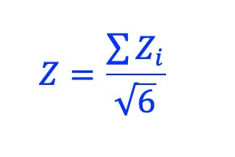

Z-score
============

Description
-------------

Calculate Z-score as an overall measurement for these six metrics. The Z-score approach becomes valuable , for example, when we are comparing a query TF with multiple other TFs to identify potential co-factors.

 - collocation coefficient (C)
 - Jaccard similarity coefficient (J)
 - Sørensen–Dice coefficient (SD)
 - Szymkiewicz–Simpson coefficient (SS)
 - pointwise mutual information (PMI)
 - normalized pointwise mutual information (NPMI)

First, values of the six metrics were converted into Z-scores by Z_i = (x – μ)/σ, where μ and σ are the average and standard deviation of the score, and i belongs to {C, J, SD, SS, PMI, NPMI}. Then, the combined Z-score is defined as: 

Usage
-----

:code:`cobind.py zscore -h`

::
 
 usage: cobind.py zscore [-h] [-l log_file] [-d] input_file.tsv output_file.tsv

 positional arguments:
   input_file.tsv        Input dataframe with row names and column names. Must
                         separate different columns with tab. If "C", "J",
                         "SD", "SS", "PMI", "NPMI" are used as the column
                         names, only these six columns will be used to
                         calculate the Z-score, otherwise, all numerical
                         columns in the dataframe will be used.
   output_file.tsv       Output dataframe with Z-scores as the last column.

 options:
   -h, --help            show this help message and exit
   -l log_file, --log log_file
                         This file is used to save the log information. By
                         default, if no file is specified (None), the log
                         information will be printed to the screen.
   -d, --debug           Print detailed information for debugging.

Example
-------

First, download the test file: `CTCF_vs_ReMap.tsv <https://sourceforge.net/projects/cobind/files/data/CTCF_vs_ReMap.tsv>`_

:code:`cobind.py zscore CTCF_vs_ReMap.tsv output.tsv`

::
  
 2023-07-06 10:20:35 [INFO]  Calculate Z-scores from "CTCF_vs_ReMap.tsv"

               C      J     SD     SS     PMI    NPMI
  TF_name
  RAD21   0.1446 0.0224 0.0438 0.9326  2.0074  0.3417
  SMC3    0.1430 0.0214 0.0420 0.9525  2.0285  0.3428
  SMC1A   0.1413 0.0211 0.0413 0.9462  2.0219  0.3407
  TRIM22  0.1400 0.0214 0.0419 0.9127  1.9858  0.3355
  STAG1   0.1368 0.0191 0.0375 0.9787  2.0556  0.3407
  ...        ...    ...    ...    ...     ...     ...
  SVIL    0.0017 0.0000 0.0000 0.1376  0.0936  0.0073
  ZNF212  0.0014 0.0000 0.0000 0.1473  0.1616  0.0122
  ZNF570  0.0012 0.0000 0.0000 0.0955 -0.2710 -0.0205
  SIRT3   0.0011 0.0000 0.0000 0.1249 -0.0033 -0.0002
  GLI1    0.0003 0.0000 0.0000 0.0267 -1.5442 -0.1054
 
  [1207 rows x 6 columns]

  2023-07-06 10:20:35 [INFO]  Save Z-scores to "output.tsv"
                C       J      SD      SS     PMI    NPMI  Zscore
  TF_name
  RAD21    3.5704  3.3312  3.2881  3.8229  2.0169  2.7221  7.6553
  SMC3     3.5114  3.1213  3.0964  3.9639  2.0615  2.7375  7.5493
  SMC1A    3.4488  3.0584  3.0218  3.9192  2.0475  2.7082  7.4317
  TRIM22   3.4009  3.1213  3.0857  3.6819  1.9711  2.6355  7.3062
  STAG1    3.2830  2.6387  2.6172  4.1494  2.1189  2.7082  7.1506
  ...         ...     ...     ...     ...     ...     ...     ...
  SVIL    -1.6949 -1.3698 -1.3765 -1.8082 -2.0337 -1.9490 -4.1772
  ZNF212  -1.7059 -1.3698 -1.3765 -1.7395 -1.8898 -1.8806 -4.0670
  ZNF570  -1.7133 -1.3698 -1.3765 -2.1064 -2.8054 -2.3373 -4.7801
  SIRT3   -1.7170 -1.3698 -1.3765 -1.8982 -2.2388 -2.0538 -4.3495
  GLI1    -1.7465 -1.3698 -1.3765 -2.5937 -5.5001 -3.5233 -6.5768
 
  [1207 rows x 7 columns]

